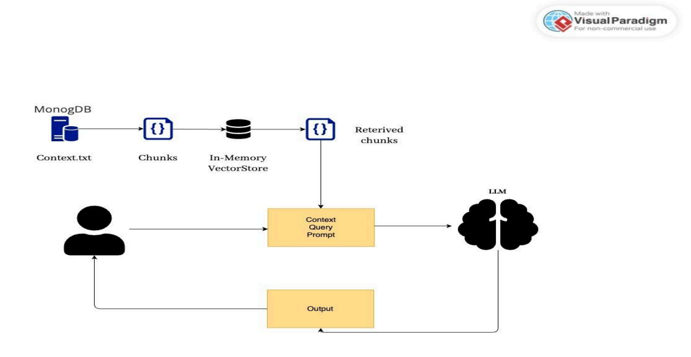
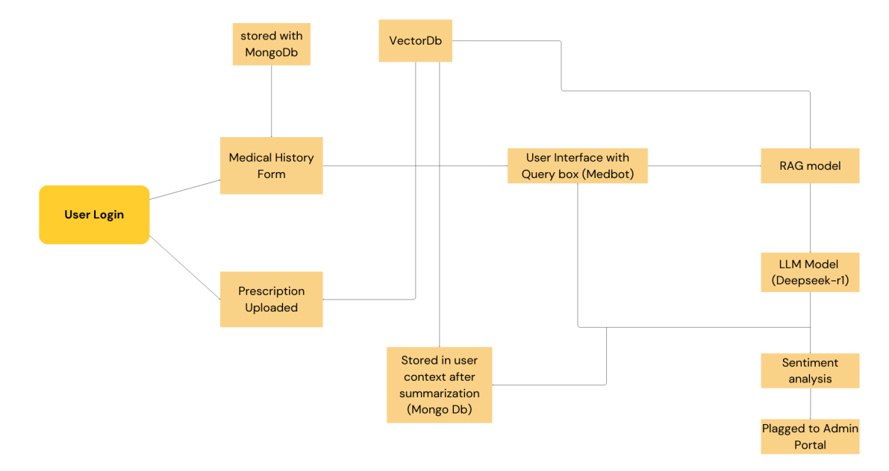

# MedBot: AI-Powered Healthcare Assistant


## 📋 Overview

MedBot is an advanced AI-powered healthcare assistant designed to transform how patients access and interact with medical assistance. Leveraging cutting-edge technologies including Optical Character Recognition (OCR), Named Entity Recognition (NER), and Retrieval-Augmented Generation (RAG), MedBot provides personalized, context-aware medical information tailored to individual users.

The project addresses key healthcare challenges including prescription interpretation difficulties, limited access to healthcare professionals, information overload, and gaps in mental health monitoring.

## ✨ Features

- **Prescription Parsing**: Upload and interpret handwritten prescriptions using AWS Textract and custom NER models
- **Contextual Medical Chatbot**: Get personalized medical information through a RAG-based architecture
- **Mental Health Monitoring**: Benefit from sentiment analysis to detect potential mental health concerns
- **Secure Local Deployment**: Ensure privacy with locally deployed language models (DeepSeek-1.1B)
- **Personalized Healthcare Knowledge**: Access personalized recommendations based on your medical history

## 🚀 Technologies

### Frontend
- React.js
- TailwindCSS
- Axios

### Backend
- Node.js
- Express.js
- MongoDB

### AI/ML Components
- DeepSeek-1.1B (Local LLM)
- AWS Textract (OCR)
- SymSpell (Medical term correction)
- Sentence Transformers (Vector embeddings)
- LangChain (LLM workflow orchestration)
- Ollama (Local model deployment)

## 🏗️ Architecture

MedBot employs several key components:

1. **Frontend Layer**: React-based web application with responsive design
2. **Backend Services**:
   - User Management Service
   - Prescription Parsing Service
   - Conversation Service
   - Medicine Information Service
   - Mental Health Monitoring Service
   - History Management Service
   - Admin Dashboard
3. **Data Layer**:
   - MongoDB for structured user data
   - In-memory Vector Database for medical knowledge
   - Secure file storage for prescriptions and documents
4. **AI/ML Components**:
   - DeepSeek-1.1B LLM (locally deployed)
   - Custom NER model
   - Embedding generation module
   - Sentiment analysis model
   - SymSpell implementation

### RAG Architecture


### System Architecture


## 🛠️ Installation

```bash
# Clone the repository
git clone https://github.com/yourusername/medbot.git
cd medbot

# Install dependencies
npm install

# Set up environment variables
cp .env.example .env
# Edit .env with your configuration

# Start the development server
npm run dev
```

## 🔒 Security & Privacy

MedBot prioritizes user data security through:

- Local deployment of the language model (DeepSeek-1.1B)
- End-to-end encryption for sensitive data
- Role-based access control
- Compliance with healthcare data regulations

## 🧪 Testing

MedBot undergoes rigorous testing including:

- **Black Box Testing**: Equivalence class partitioning and boundary value analysis
- **White Box Testing**: Unit tests and integration tests
- **API Testing**: Comprehensive endpoint validation

## 👥 Contributors

- Shantanu Rai ([@shantanu](https://github.com/SHANTANU-RAI))
- Isha Singh ([@isha](https://github.com/ishaaaa8))


## 🔮 Future Enhancements

- Electronic Health Record (EHR) integration
- Multi-language support
- Voice interface capabilities
- Telehealth service integration
- Medication reminder system
